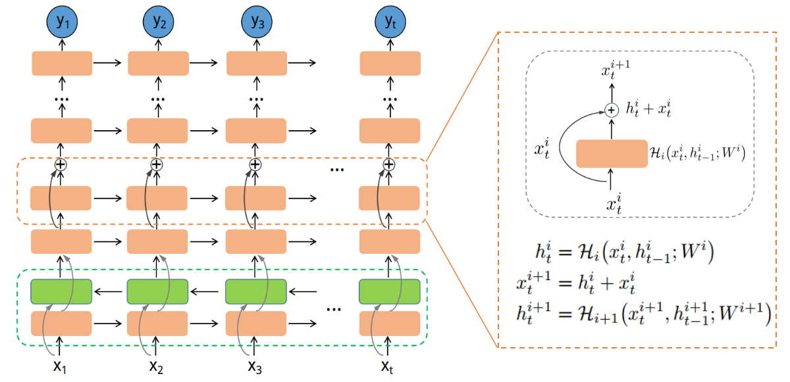
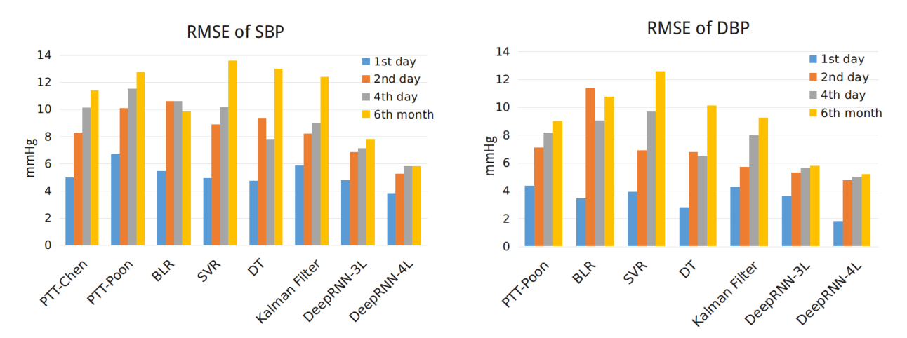
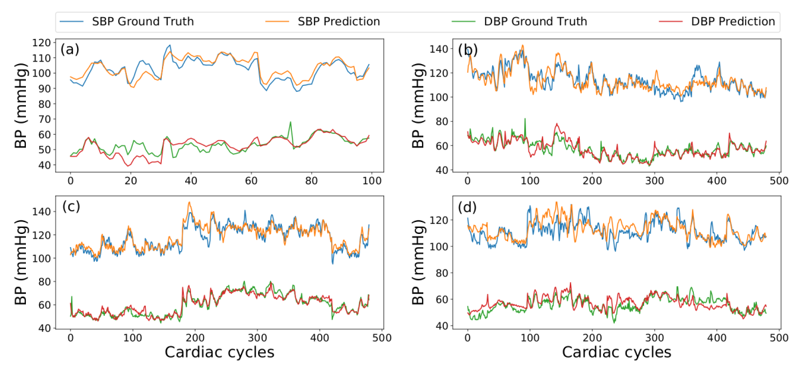

[Paper](https://arxiv.org/abs/1705.04524)	&nbsp;&nbsp;	
[Poster](http://www.ee.cuhk.edu.hk/~psu/img/BHI2018.pdf) &nbsp;&nbsp;	
[Project](https://psu1.github.io/DeepRNN/)

## Video Demo (real-time BP prediction)
In nutshell, we build a novel Recurrent Neural Networks to predict arterial blood pressure (BP) from ECG and PPG signals which can be easily collected from wearable devices. The top two channels in the demo below are input ECG and PPG signals, the bottom channel plots the real-time BP prediction and BP ground truth.

## Project at a glance

Existing methods for arterial blood pressure (BP) estimation directly map the input physiological signals to output BP values without explicitly modeling the underlying temporal dependencies in BP dynamics. As a result, these models suffer from accuracy decay over a long time and thus require frequent calibration. In this work, we address this issue by formulating BP estimation as a sequence prediction problem in which both the input and target are temporal sequences. We propose a novel deep recurrent neural network (RNN) consisting of multilayered Long Short-Term Memory (LSTM) networks, which are incorporated with (1) a bidirectional structure to access larger-scale context information of input sequence, and (2) residual connections to allow gradients in deep RNN to propagate more effectively.The proposed deep RNN model was tested on a static BP dataset, and it achieved root mean square error (RMSE) of 3.90 and 2.66 mmHg for systolic BP (SBP) and diastolic BP (DBP) prediction respectively, surpassing the accuracy of traditional BP prediction models. On a multi-day BP dataset, the deep RNN achieved RMSE of 3.84, 5.25, 5.80 and 5.81 mmHg for the 1st day, 2nd day, 4th day and 6th month after the 1st day SBP prediction, and 1.80, 4.78, 5.0, 5.21 mmHg for corresponding DBP prediction, respectively, which outperforms all previous models with notable improvement. The experimental results suggest that modeling the temporal dependencies in BP dynamics significantly improves the long-term BP prediction accuracy.

## Network Architecture 

Simple but proven to work very well. Detailed mathematical explanation behind such design is provided in paper Section 3.

DeepRNN architecture. Each rectangular box is an LSTM cell. The green dashed box at bottom is a bidirectional
LSTM layer consisting of forward (orange) and backward (green) LSTM. The orange dashed box depicts the LSTM
layer with residual connections.

## Results

### 1.Generalization capability across different subjects.
Detailed analysis of our Deep RNN models with comparison with different reference models. DeepRNN-xL
represents a x layer RNN model. All the models are validated on the static continuous BP dataset. (unit: mmHg)

 

Bland-Altman plots of the overall SBP and DBP predictions by a DeepRNN-4L model on the static continuous BP dataset. 

### 2.Generalization capability over a long period of time.

Overall RMSE comparison of different models on the multi-day continuous BP dataset.

Qualitative example to show the
capability of DeepRNN to track long-term BP variation 
Figure (a), (b), (c) and (d) represent the results of 1st day, 2nd day, 4th day and 6th month after the 1st day, respectively.

## Citation
    @article{su2017predicting,
      Author = {Su, Peng and Ding, Xiao-Rong and Zhang, Yuan-Ting and Liu, Jing and Miao, Fen and Zhao, Ni},
      Title = {Long-term Blood Pressure Prediction with Deep Recurrent Neural Networks},
	Journal = {arXiv preprint arXiv:1705.04524},
	  Year = {2017}
    }
    
    @inproceedings{su2018long,
  	title={Long-term Blood Pressure Prediction with Deep Recurrent Neural Networks},
  	author={Su, Peng and Ding, Xiao-Rong and Zhang, Yuan-Ting and Liu, Jing and Miao, Fen and Zhao, Ni},
 	 booktitle={Biomedical \& Health Informatics (BHI), 2018 IEEE EMBS International Conference on},
 	 year={2018},
  	organization={IEEE}
}
    
Due to the patent issue, the code and dataset will be released later. 
  
